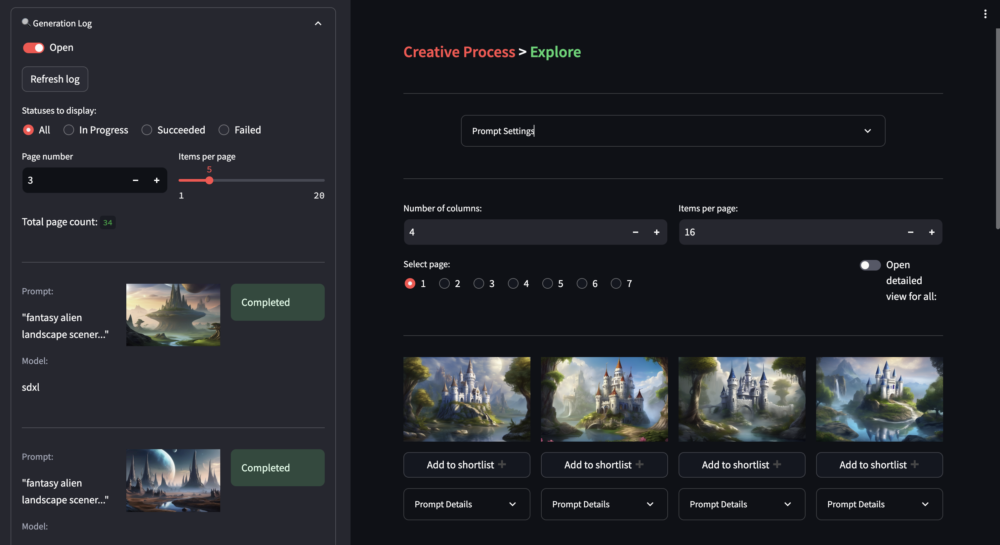

# ** Work in progress **

# Welcome to Banodoco

Banodoco is a simple but powerful open-source animation tool built on top of Stable Diffusion, AnimateDiff, SVD and other OS AI models/tools. The app is in early phases and many tools and workflows are yet to be integrated (check the roadmap below).

## Installation
You can check the hosted preview version of Banodoco <a href="https://app.banodoco.ai/" target="_blank">here</a>. Support for local inference is in progress and will soon be updated.

## Roadmap
Below is the product roadmap. Please reach out to us in our [discord](https://discord.com/invite/8Wx9dFu5tP) if you have suggestions/requests or want to contribute in its development.

- [x] Basic scene generation
- [x] AnimateDiff animation workflow
- [x] Third-party inference support (Replicate)
- [x] Hosted version
- [ ] Consistent scene/character generation
- [ ] SVD animation workflow with motion controlnets
- [ ] Local GPU inference
- [ ] Comfy toolformer
