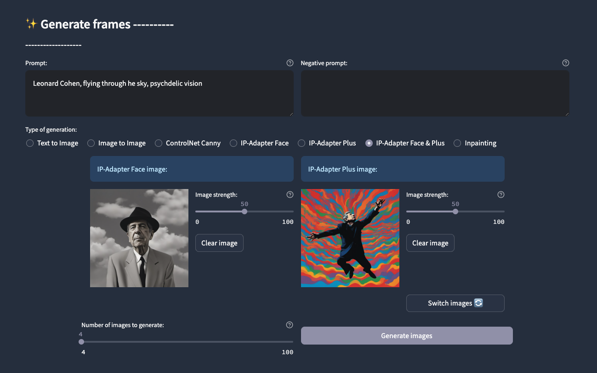
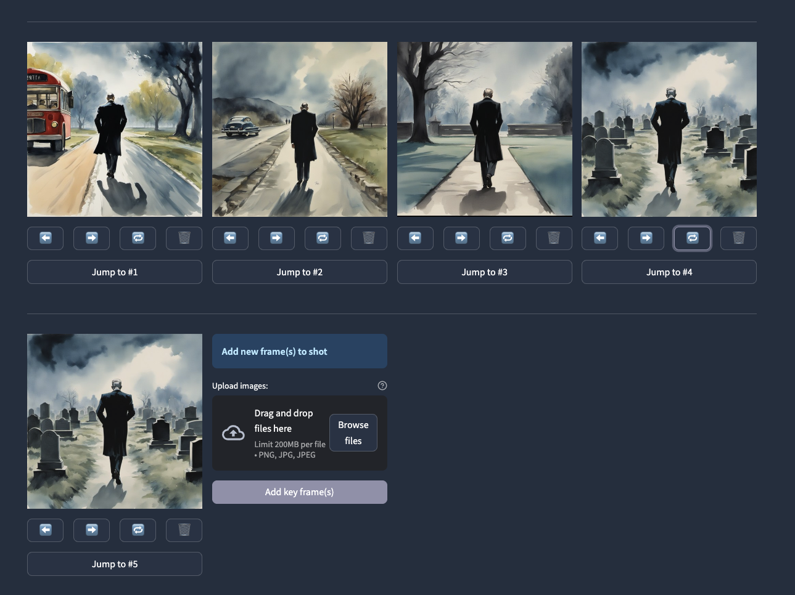
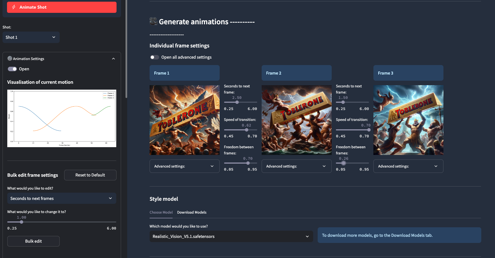
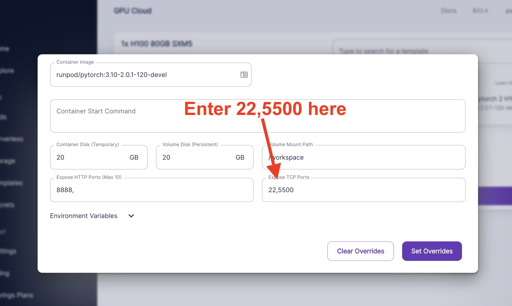
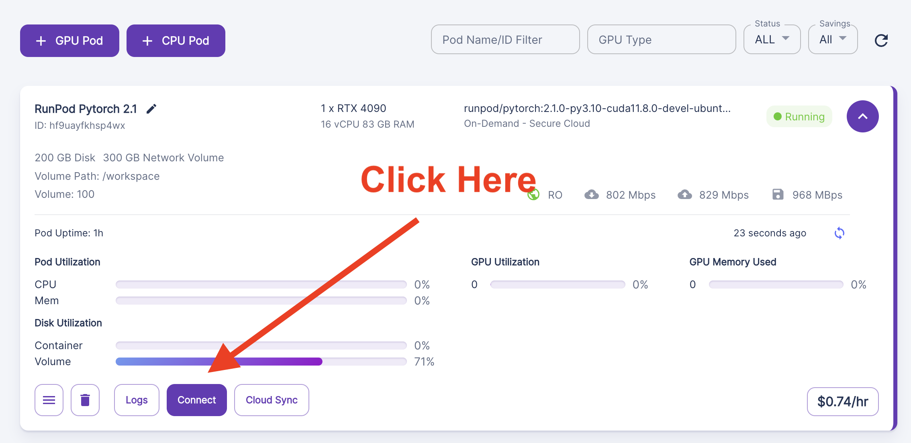
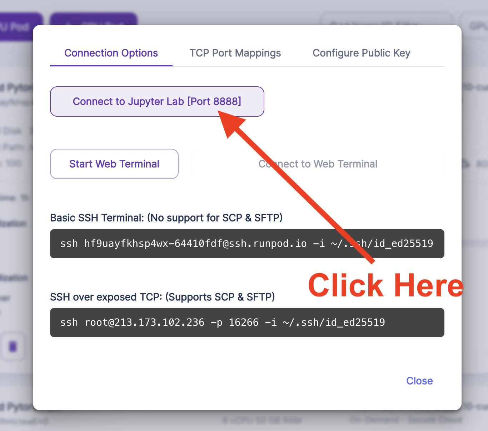
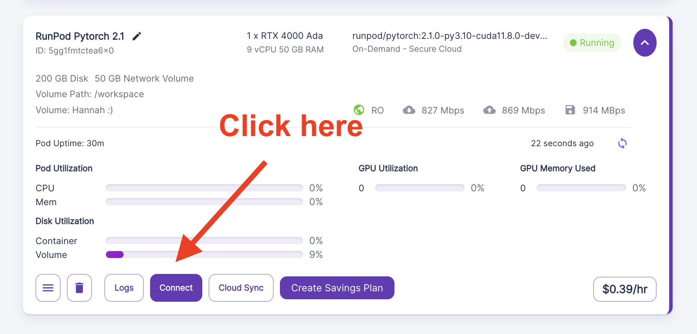
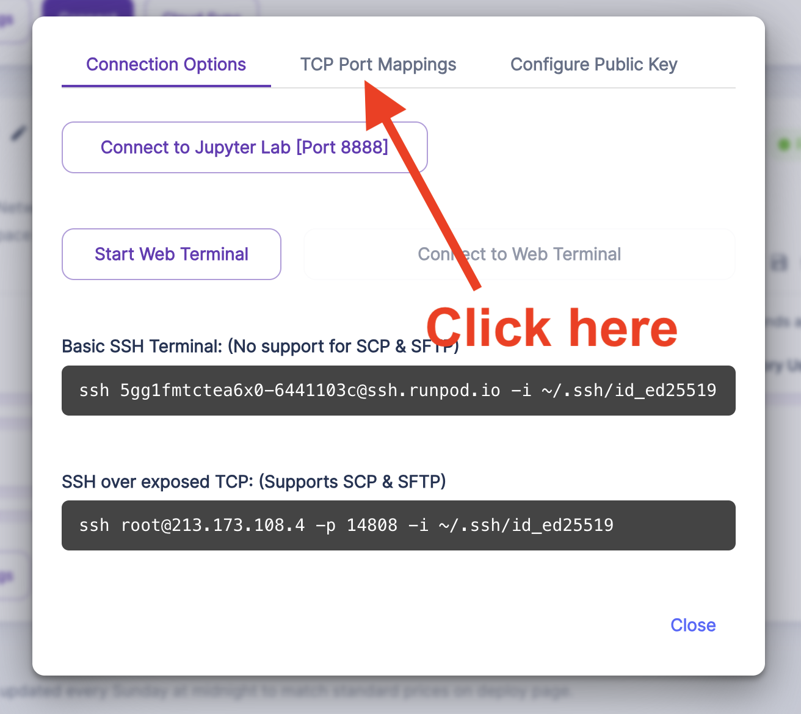

# Welcome to Dough v. 0.5 (beta)

**⬇️ Scroll down for Setup Instructions - Currently available on Linux & Windows, hosted version coming soon.**

Dough is a tool for crafting videos with AI. Our goal is to give you enough control over video generations that you can make beautiful creations of anything you imagine that feel uniquely your own.

To achieve this, we allow you to guide video generations with precision using a combination of images (via [Steerable Motion](https://github.com/banodoco/steerable-motion)) examples videos (via [Motion Director](https://github.com/ExponentialML/AnimateDiff-MotionDirector)).

Below is brief overview and some examples of outputs:

### With Dough, you can makes guidance frames using Stable Diffusion XL, IP-Adapter, Fooocus Inpainting, and more:



### You can then assemble these frames into shots that you can granularly edit:



### And then animate these shots by defining parameters for each frame and selecting guidance videos via Motion LoRAs:



### As an example, here's a video that's guided with just images on high strength:


### While here's a more complex one, with low strength images driving it alongside a guidance video:


### And here's a more complex example combining high strength guidance with a guidance video strongly influencing the motion:


### We're obviously very biased think that it'll be possible to create extraordinarily beautiful things with this and we're excited to see what you make! Please share stuff you made in our [Discord](https://discord.com/invite/8Wx9dFu5tP).


# Setup Instructions

<details>
  <summary><b>Setting up on Runpod (click to expand)</b></summary>

  
1) We recommend setting up persistent storage for a quick setup and for your projects to persist. To get it going, click into “Storage”, select “New Network Volume”. 50GB should be more than enough to start.


2) Select a machine - any should work, but we recommend a 4090.


3) During setup, open the relevant ports for Dough like below:





4) When you’ve launched the pod, click into Jupyter Notebook:






5) Follow the “Setup for Linux” below and come back here when you’ve gone through them.


6) Once you’re done that, grab the IP Address for your instance:






Then form put these into this form with a : between them like this:

{Public ID}:{External Pair Value}

In the above example, that would make it:

213.173.108.4:14810

Then go to this URL, and it should be running!

**Important:** remember to terminate the instance once you’re done - you can restart it by following the instructions from step 3 above.

</details>


## Instructions for Linux:

### Install the app

This commands sets up the app. Run this only the first time, after that you can simply start the app using the next command.
```bash
curl -sSL https://raw.githubusercontent.com/banodoco/Dough/green-head/scripts/linux_setup.sh | bash
```

### Run the app

you can run the app using 

```bash
source ./dough-env/bin/activate && ./scripts/entrypoint.sh
```

## Instructions for Windows:

### Install the app

- Install MS C++ Redistributable (if not already present) - https://aka.ms/vs/16/release/vc_redist.x64.exe

Run the setup script

```bash
iwr -useb "https://raw.githubusercontent.com/banodoco/Dough/green-head/scripts/windows_setup.bat" -OutFile "script.bat"
Start-Process "cmd.exe" -ArgumentList "/c script.bat"
```

### Run the app

```bash
. .\dough-env\Scripts\activate ; .\scripts\entrypoint.bat
```

If you're having any issues, please share them in our [Discord](https://discord.com/invite/8Wx9dFu5tP).